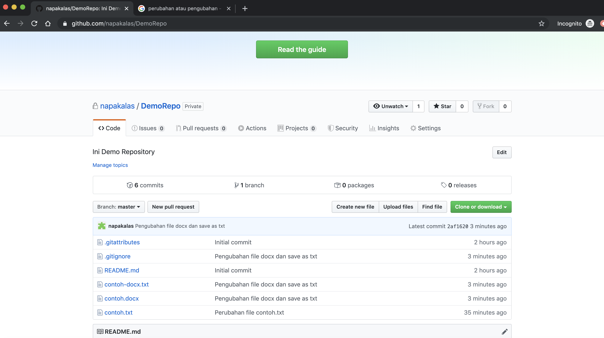

# Manajemen data menggunakan GitHub

## Kebutuhan aplikasi:
- Buat akun GitHub [https://github.com/](https://github.com/)
  - Username
  - Email
  - Password
- Instal GitHub Desktop [https://desktop.github.com/](https://desktop.github.com/)
  - Instal Git
    - Repository => Open in Command Prompt
    - Click Install Git
  - Set Git Username
    - Di terminal yang terbuka, eksekusi perintah:
      - git config --global user.name "USERNAME"
  - Set Git Email
    - Di terminal yang terbuka, eksekusi perintah:
      - git config --global user.email "EMAIL"
  - Restart GitHub Desktop
  - Login melalui GitHub Desktop
    - GitHub Desktop => Preference => Sign In
- (Opsional) Instal aplikasi untuk mengubah doc, docx ke md
  - Windows => bisa install [http://www.writage.com/#download](http://www.writage.com/#download)
  - Alternatif untuk semua platform: Pandoc [https://pandoc.org/installing.html](https://pandoc.org/installing.html)
  - Atau gunakan Save As text jika tidak ingin mengubah ke md.

## Membuat Repository:
Untuk memanfaatkan GitHub kita perlu menyiapkan lokasi penyimpanan baik di perangkat lokal maupun online.
1. Akses menu "New Repository".
  
2. Beri nama Repository dan lokasi di perangkat lokal.
  
3. Selanjutnya kita bisa meletakkan repository lokal ke server GitHub. Tekan "Publish Record".
  
  Nama repository di server bisa diubah, demikian juga dengan deskripsinya. Pilihan private atau tidak private berkaitan dengan akses pihak luar ke repository. Dengan setting private sekalipun kita masih bisa memberi akses berdasarkan akun.
  
4. Sekarang Repository sudah ada di server.
  
  Jangan lupa login ke GitHub kalau repository di-setting private.

## Mengatur Repository:
Di Repository lokal kita dapat menambahkan atau mengubah file apapun secara fleksibel. Satu rangkaian penambahan atau pengubahan ini selanjutnya bisa disimpan state-nya melalui perintah commit. Jika kita melakukan beberapa commit, maka semua state akan disimpan, dan kita dapat mengakses file berdasarkan state.

### Penambahan / pengubahan file ke repository lokal:

#### File berbasis txt
- Buat file txt kemudian simpan di folder repository.
  
- Di aplikasi GitHub Desktop akan muncul "changes" berkaitan dengan penambahan file contoh.txt. Kita bisa juga melihat detil perubahan file contoh.txt di sisi kanan.
 
- Selanjutnya, perubahan yang sudah dilakukan bisa disimpan dengan melakukan "commit". Sebagaimana di daftar changes mungkin akan muncul file-file yang tidak diharapkan seperti .DS_Store yang merupakan auto generated file. Maka file-file ini tidak perlu disertakan dan lebih baik diletakkan di daftar .gitignore, sehingga di masa mendatang tidak akan dipertimbangkan oleh Git sebagai perubahan.
  - Ignore file:
    
  - Commit state:
    Isi bagian "Summary (required)", "Description" sifatnya Opsional, Tekan tombol "Commit to master"
    
    <kbd>**Saran: Commit sebaiknya dilakukan secara periodik setelah kita puas dengan progres pekerjaan kita. Jika kita menyimpan file data maka sebaiknya diikuti dengan commit.**</kbd>
  - Dengan commit daftar "changes" akan hilang, tapi perubahan disimpan di history.
    
    
  - Sekarang ubah file contoh.txt: "Ini baris pertama" diganti menjadi "Ini baris 1":
    
  maka di changes akan muncul keterangan perubahan file contoh.txt, dengan warna merah adalah baris yang dihapus atau diubah lengkap dengan posisi barisnya, sedangkan warna hijau adalah baris yang ditambahkan atau pengubah lengkap dengan posisi barisnya. Ketika dilakukan commit, maka akan disimpan sebagai history baru.
    Changes sebelum commit:
    
    History setelah commit:
    

#### File binary, misalkan docx, xslx, pdf, pptx.
- Penambahan dan pengubahan file binary ke repository pada dasarnya sama saja dengan file txt. Bedanya hanya changes dan history tidak bisa menyimpan detil teks yang berubah, namun hanya informasi perubahan besaran file asal dan yang baru. Contoh penambahan file contoh.docx
  
  
- Untuk commit, file ~$contoh.docx sebaiknya di-ignore
  
- Pengubahan contoh.docx, (langsung hasil commit)
  
- Bagaimanapun kita menginginkan ada informasi perubahan terhadap file binary. Untuk keperluan tersebut ada baiknya melakukan export ke file txt sebelum commit dan menyimpan file txt tersebut di folder yang sama. Format file txt yang paling nyaman digunakan di GitHub adalah MarkDown (md). Untuk melakukan export bisa dengan menginstall plugin [writage](http://www.writage.com/#download) untuk OS Windows sehingga bisa melakukan Save As MarkDown. Untuk MacOS dan Linux bisa menggunakan [Pandoc](https://pandoc.org/installing.html), namun perlu mengeksekusi command dari Terminal. Jika tidak mau ribet, maka bisa juga melakukan Save As Plain Text. Berikut adalah hasil commit setelah melakukan pengubahan di contoh.docx dan Save As Plain Text dengan nama file teks contoh-docx.txt.
  

### Update state dan upload file ke server:
Sekarang kita sudah memiliki 6 commit, dimana penyimbanannya masih di perangkat lokal. Berikutnya adalah menyimpan semua file dan semua state history.
- Untuk update state dan upload ke server, cukup tekan tombol "Push origin" di kanan atas.
  
- Maka semua file akan dikirim ke server beserta catatan perubahannya. Berikut adalah kondisi repository di akun GitHub sebelum dan sesudah Push.
  
  
- Untuk melihat catatan History di GitHub, tekan link commits
  
  didapatkan:
  
- Untuk melihat daftar perubahan per history tekan link angka hash di sebelah kanan. Misalkan untuk history terakhir yang mengubah file contoh.docx dan Save As contoh-docx.txt didapatkan catatan:
  
  didapatkan:
  
Pada halaman ini kita bisa melihat detil perubahan yang mirip dengan repository di perangkat lokal meliputi penambahan dan perubahan file contoh-docx.txt dan perubahan ukuran file contoh.docx

### Download file sesuai state history:
Ada kalanya kita ingin mendapatkan file pada state history yang sudah lampau. Untuk itu, dari server GitHub, kita bisa mengakses history tertentu, dan mengunduh file dari posisi tersebut.
- Misalkan dari repository contoh, kita ingin mengunduh history ke 2.
  
  didapatkan:
  
- Untuk mengakses file, tekan tombol "Browse File", didapatkan:
  
- File bisa diunduh satu persatu sesuai kebutuhan atau dalam bentuk file zip secara keseluruhan.

### Sharing pekerjaan di GitHub
Untuk repository yang private, kita bisa memberi hak ke akun lain dengan menambahkan collaborator.
- Tekan Settings:
  
- Tekan Collaborators:
  
- Tambahkan Collaborators

### Q & A
1. Kalau ngubahnya di GitHub secara online lalu ingin update repository lokal, bagaimana caranya?
  Tekan tombol Fetch origin
  
2. Digabung dengan Google Stream apa bisa?
  Bisa banget, tinggal local repository diarahkan ke directory Google Stream. Otomatis dapat 3 duplikasi file, lokal, google drive, dan GitHub.

Pertanyaan lebih lanjut silahkan sampaikan di [Issues](https://github.com/napakalas/demo_github/issues)
